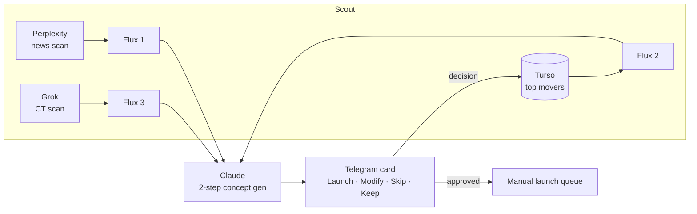

# GabsavClawd

> An autonomous meme-token scout for [pump.fun](https://pump.fun) on Solana: it continuously scans mainstream news, social feeds, and Crypto Twitter, generates token concepts with Claude, and sends each one to Telegram for a one-tap human decision before anything is launched.
>
> *Un scout autonome de meme tokens pour pump.fun (Solana) : il scanne en continu l'actualité, les réseaux et Crypto Twitter, génère des concepts de token avec Claude, et envoie chacun sur Telegram pour une décision humaine en un tap avant tout lancement.*

> **Personal project · human-in-the-loop by design.** No token is ever launched automatically — every concept is reviewed and copied to pump.fun manually. Credentials and runtime data are not published.
>
> *Projet personnel · human-in-the-loop par conception. Aucun token n'est lancé automatiquement — chaque concept est relu et copié manuellement sur pump.fun.*

---

## 🇬🇧 English

### What it does

Three independent generation pipelines run on their own timers, each following the same discipline — **find a signal, verify the Crypto Twitter reaction, reason about the angle, *then* name the token**:

| Pipeline | Direction | Source | Cadence |
|---|---|---|---|
| **Flux 1** | World → Crypto | Perplexity scans mainstream & social media for high-signal moments; Grok enriches each with the CT reaction | every 30 min |
| **Flux 2** | Crypto → Crypto | Top movers by 1h volume; Grok analyses *why* each is pumping and the meme angle | every 60 min |
| **Flux 3** | CT Trend | Grok surfaces rising narratives on Crypto Twitter; top movers injected as market context | every 45 min |

Each candidate becomes a **concept card** in Telegram with four inline buttons — **Launch**, **Modify** (free-text edit), **Skip**, **Keep angle** — writing the decision straight back to the database. Approved concepts queue in memory for the human to launch manually. Deduplication windows per pipeline (6h / 2h / keyword-match) stop the same idea recycling across cycles.

### Engineering highlights

- **Two-step prompting to beat generic output.** Every generator states the underlying meme angle *before* naming the token — reasoning precedes the verdict, so concepts are grounded in a real signal instead of a plausible-sounding hallucination.
- **Multi-model orchestration.** Perplexity (news retrieval), xAI Grok (Crypto Twitter reaction & enrichment), and Claude (concept generation) each do the job they're best at, wired into one loop.
- **Silent-signal handling.** Enrichment returns `null` when CT is quiet, and generators fall back to first-principles reasoning rather than forcing a weak concept.
- **Zero-build runtime.** Node.js ESM with Node's native `--env-file` — no bundler, no TypeScript, no `dotenv`. Turso (libSQL) as the cloud database.

### Architecture



### Tech stack

Node.js (ESM) · Claude API · Perplexity API · xAI Grok API · Telegram Bot API · Turso (libSQL) · Express (dashboard).

---

## 🇫🇷 Français

### Ce que ça fait

Trois pipelines de génération indépendants tournent sur leurs propres timers, chacun suivant la même discipline — **trouver un signal, vérifier la réaction Crypto Twitter, raisonner sur l'angle, *puis* nommer le token** :

| Pipeline | Sens | Source | Cadence |
|---|---|---|---|
| **Flux 1** | Monde → Crypto | Perplexity scanne médias & réseaux pour les moments à fort signal ; Grok enrichit chacun de la réaction CT | 30 min |
| **Flux 2** | Crypto → Crypto | Top movers par volume 1h ; Grok analyse *pourquoi* ça pump et l'angle meme | 60 min |
| **Flux 3** | Tendance CT | Grok fait remonter les narratifs montants sur Crypto Twitter ; top movers injectés comme contexte marché | 45 min |

Chaque candidat devient une **carte concept** dans Telegram avec quatre boutons — **Launch**, **Modify** (édition libre), **Skip**, **Keep angle** — écrivant la décision directement en base. Les concepts approuvés sont mis en file en mémoire pour un lancement manuel. Des fenêtres de dédoublonnage par pipeline (6h / 2h / match par mots-clés) empêchent une même idée de recycler entre cycles.

### Points d'ingénierie notables

- **Prompting en deux étapes contre la sortie générique.** Chaque générateur énonce l'angle meme sous-jacent *avant* de nommer le token — le raisonnement précède le verdict, donc les concepts sont ancrés dans un vrai signal plutôt qu'une hallucination plausible.
- **Orchestration multi-modèles.** Perplexity (récupération d'actu), xAI Grok (réaction & enrichissement Crypto Twitter) et Claude (génération de concept) font chacun ce pour quoi ils sont les meilleurs, câblés dans une seule boucle.
- **Gestion des signaux silencieux.** L'enrichissement renvoie `null` quand CT est calme, et les générateurs retombent sur un raisonnement de fond plutôt que de forcer un concept faible.
- **Runtime sans build.** Node.js ESM avec le `--env-file` natif de Node — pas de bundler, pas de TypeScript, pas de `dotenv`. Turso (libSQL) comme base cloud.

### Stack technique

Node.js (ESM) · API Claude · API Perplexity · API xAI Grok · API Telegram Bot · Turso (libSQL) · Express (dashboard).

---

## Setup

```bash
npm install
npm start          # production — loads .env via Node --env-file
npm run dev        # dev — same + --watch hot reload
npm run dashboard  # dashboard server
```

**Required environment variables** (`.env`):

| Variable | Used by |
|---|---|
| `ANTHROPIC_API_KEY` | Claude concept generation |
| `PERPLEXITY_API_KEY` | Flux 1 news scan |
| `XAI_API_KEY` | Grok CT scan & enrichment |
| `TELEGRAM_BOT_TOKEN` / `TELEGRAM_CHAT_ID` | Telegram review bot |
| `TURSO_DATABASE_URL` / `TURSO_AUTH_TOKEN` | Turso cloud database |

## Project structure

```
src/
├── index.js                 # Orchestrates all cycles and timers
├── scout/
│   ├── perplexityScout.js   # Mainstream/social news scan (Flux 1)
│   └── grokScout.js         # CT scan + per-signal/token enrichment
├── creative/
│   └── conceptGenerator.js  # Claude — 2-step concept generation
├── bot/
│   └── telegramBot.js       # Long-poll bot, interactive concept review
└── database/
    └── db.js                # Turso schema, migrations, query helpers
```

---

*Repository maintained by [Gabriel Savean](https://github.com/Gabsavage).*
